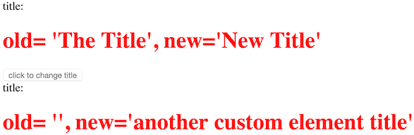

## Tutorial details
In this tutorial you'll learn some of the more fundamental concepts of `delite`.

##Going back to basics
As shown in the [introduction tutorial](introduction.md) example, Templating support is provided 'out of the box' with `delite` and straightforward to implement.
We'll now look at an example which doesn't use templating; this would not be a normal use case but it's worth showing to explore some of
the fundamentals of a `delite` custom element.

### create the scaffold

Again we'll use the `generator-delite-element` Yeoman generator.

Create a new directory somewhere (named `title-package`, which will also be our package name) and change directory to it using the commands :

    mkdir -p title-package
    cd title-package

Run Yeoman to create our scaffold

    yo delite-element

You'll be prompted to enter the widget package name & the name of the custom widget element, enter the following choices shown in brackets below.

    ? What is the name of your delite widget element package? (title-package)
    ? What do you want to call your delite widget element (must contain a dash)? (title-widget)
    ? Would you like your delite element to be built on a template? (n)
    ? Would you like your delite element to providing theming capabilities? (n)
    ? Will your delite element require string internationalization? (n)
    ? Will your delite element require pointer management? (n)
    ? Do you want to use build version of delite package (instead of source version)? (n)

### What's been generated
Yeoman created the following (as shown in the console output):

We've created a new package named `title-package` for new widgets that we'll create.

- `./TitleWidget.js` - __this is our widget module__
- `./TitleWidget/css/TitleWidget.css` - __this is our widget css__
- `./samples/TitleWidget.html` - __this is a sample how to use our new widget__

This is the most basic setup for a widget/custom component. You can view the sample generated HTML `./samples/TitleWidget.html`
in a browser to see what's been created.

Click here to see the live demo:
[Delite Basics Tutorial - Part 1](http://ibm-js.github.io/delite-tutorial/runnable/basics-part1/samples/TitleWidget.html)

###A look at the widget lifecycle methods for our simple widget
If we look at our custom element module  ``./TitleWidget.js`` we can see two methods have been created for us, `render` and `refreshRendering`.
`render` is the simplest of [lifecycle](https://github.com/ibm-js/delite/blob/master/docs/Widget.md#lifecycle)
methods we need to create our widget.

#### `render`
We normally wouldn't create a `render` method because typically we'd be using templates to create the widget UI (which was shown earlier
on) but because we aren't using a template we need to implement `render` ourselves.

In this `render` method we're adding `<span>title</span>` and `<h1></h1>` elements to our widget as well as assigning a property
to the widget named `_h1` i.e. via `this.appendChild(this._h = this.ownerDocument.createElement("h1"));` which we can use to update
it programmatically or set it declaratively.

In comparison to the previous templated widget you see it obviously requires much more work.

#### `refreshRendering`
`refreshRendering` is also a lifecycle method but implemented in `decor/Invalidating`, which `delite/Widget` inherits from.

Its purpose is to observe changes to properties defined on the widget and update the UI. In your web browser developer tools, if
you place a breakpoint in that method and then click the "*click to change title*" button, you'll see this method is called
(because the button adds inline JavaScript to update the element's value property i.e.
`onclick="element.value='New Title'; event.target.disabled=true"`).

If we wanted to see what the old value was (and also display it to the DOM) we can change this method in `./TitleWidget.js` from

```js

refreshRendering: function (props) {
    // if the value change update the display
    if ("value" in props) {
        this._h.innerHTML = this.value;
    }
}

```

to the following:

```js

refreshRendering: function (props) {
    // if the value change update the display
    if ("value" in props) {
        this._h.innerText = "old= '" + props["value"] + "', new='" + this.value + "'";
    }
}

```

Also let's update the `./samples/TitleWidget.html` JavaScript from:

```js

require(["title-package/TitleWidget"], function (TitleWidget) {

});

```

to add a programmatically created widget:

```js

require(["title-package/TitleWidget"], function (TitleWidget) {
    var anotherTitleWidget = new TitleWidget({value : 'another custom element title'});
    anotherTitleWidget.placeAt(document.body, 'last');
});

```

Click here to see the live demo:
[Delite Basics Tutorial - Part 2](http://ibm-js.github.io/delite-tutorial/runnable/basics-part2/samples/TitleWidget.html)


If not already set, set a breakpoint (via your JavaScript debugger) to the `refreshRendering` method of our custom element module `./TitleWidget.js` and
reload the page.

Notice when you first load the page, this method will be called for each widget, you'll also see that the `value` property of our widget is
contained in the `props` argument of this method.

This is because we're setting the `value` property on the declaratively written widget to `value="The Title"` and setting the value property
on the programmatically written widget to `value : "another custom element title"`.

If you don't set the `value` property of the widget at construction time, the `value` property of our widget is NOT contained in the `props` argument.

Click the 'click to change title button' and the widget will render like:

> 

If you still have a breakpoint set in `refreshRendering` you will see again that the `value` property of our widget is again contained in the `props`
argument.

Update the value `property` of `./TitleWidget.js` to:

```js

value: "The Title",

```

And reload the page. Notice again the `value` property of our widget is NOT contained in the `props` argument. This is because the property value hasn't changed.
The [decor/Invalidating](https://github.com/ibm-js/decor/blob/master/docs/Invalidating.md) documentation explains this behaviour.

Click here to see the live demo:
[Delite Basics Tutorial - Part 3](http://ibm-js.github.io/delite-tutorial/runnable/basics-part3/samples/TitleWidget.html)

---

## Round up
As you've seen, the basics of `delite` are very easy when building a custom element, keeping in mind we've only touched on some of the capabilities of this project.
We've also touched on some lower level concerns of `delite`.

We'll expand on this in future and discuss more advanced topics in a later tutorial.
