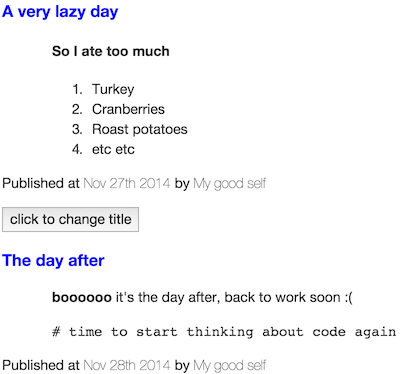

## Tutorial details
In this tutorial you'll learn how to create your own custom elements, learn how to register them, learn how to use templates
and learn how to theme them. It's a beginner tutorial so we won't be delving too deep into what `delite` provides (yet!!!).


## Getting started
To quickly get started, we're using [https://github.com/ibm-js/generator-delite-element](https://github.com/ibm-js/generator-delite-element)
to install the required dependencies and create a basic scaffold.

Install the `generator-delite-element` globally (or update it if necessary).

    npm install -g generator-delite-element

##Templates
`delite` provides first class support for templates. We wouldn't expect to programmatically create DOM nodes & this is where
`delite` comes into it's own; out of the box `delite` supports templating using a built in implementation of [Handlebars](http://handlebarsjs.com/).

Note there are some limitations using the `delite/handlebars!` plugin for templating, namely it doesn't support iterators or conditionals.
However in many cases this isn't a limiting factor.
Alternate templating engines can be plugged in if needed; support for this will be explained in a later more advanced tutorial when we discuss
[Liaison](https://github.com/ibm-js/liaison). The handlebars template implementation `delite` uses is primarily focused on performance.

Let's try create a 'real life' widget, for example a blogging widget.

### create the scaffold
We'll create a new `delite` custom element using Yeoman.

From the command line create a new directory somewhere (named `blogging-package`) and change directory to it using the commands:

    mkdir -p blogging-package
    cd blogging-package

Run Yeoman to create our scaffold.

    yo delite-element

You'll be prompted to enter the widget package name and the name of the custom widget element. Set the following choices shown in brackets below.

    ? What is the name of your delite widget element package? (blogging-package)
    ? What do you want to call your delite widget element (must contain a dash)? (blog-post)
    ? Would you like your delite element to be built on a template? (Y)
    ? Would you like your delite element to providing theming capabilities? (N)
    ? Will your delite element require string internationalization? (N)
    ? Will your delite element require pointer management? (N)
    ? Do you want to use build version of delite package (instead of source version)? (N)

### What's been generated
Yeoman created the following (as shown in the console output):

- `./BlogPost.js` - __this is our widget module__
- `./BlogPost/css/BlogPost.css` - __this is our widget css__
- `./BlogPost/BlogPost.html` - __this is our widget template__
- `./samples/BlogPost.html` - __this is a sample how to use our new widget__

You can view the sample generated HTML `./samples/BlogPost.html` in a browser to see what's been created.

Click here to see the live demo:
[Delite Introduction Tutorial - Part 1](http://ibm-js.github.io/delite-tutorial/runnable/introduction-part1/samples/BlogPost.html)

## Creating a custom element
Viewing the `./samples/BlogPost.html` example HTML we can see we've (partly) created the custom element declaratively in markup via:

```html

<blog-post id="element" value="The Title"></blog-post>

```

If you open your browser developer tools and in the console enter `myvar = document.getElementById('element')` and then explore
the properties on that variable `myvar`, you'll see it's just a regular HTML element <sup><a href="#footnote1">[1]</a></sup>;
if you're more inquisitive you might be able to see there are extra properties/methods on this element which is what the `delite` framework is providing.

###Registering

The `<blog-post>` element doesn't constitute a custom element on its own; it first needs to go through a registration process which is achieved using
the `delite/register` module. This is analogous to the HTML specification for registering custom elements
i.e. `document.registerElement('blog-post');`

If we look at the custom element module `./BlogPost.js` we see that we register the custom element tag via the `return register(....)` method:

```js

define([
	"delite/register",
	"delite/Widget",
	"delite/handlebars!./BlogPost/BlogPost.html",
	"requirejs-dplugins/css!./BlogPost/css/BlogPost.css"
], function (register, Widget, template) {
	return register("blog-post", [HTMLElement, Widget], {
		baseClass: "blog-post",
		value: "",
		template: template
	});
});

```


This is an important concept which sometimes isn't clear at a first glance. You can add any non-standard tag to an HTML page and the browser HTML parser
will not complain; this is because these elements will be defined as a native
`HTMLUnknownElement`<sup><a href="#footnote2">[2]</a></sup>.
To create a custom element it must be **upgraded** first; this is what `delite/register` does. `delite/register` supports browsers who natively
support `document.registerElement` and those who don't.

The registration process above using `delite/register`, creates a custom element by registering the tag name `"blog-post"` as the first
argument and then inheriting (prototyping) the `HTMLElement` native element (as well as the `"delite/Widget"` module).

Elements which inherit from `HTMLElement`
using [valid custom element names](http://www.w3.org/TR/2013/WD-custom-elements-20130514/#dfn-custom-element-name) are custom elements.
The most basic requirement for the tag name is it **MUST** contain a dash **(-)**.

In case there's any confusion, note that the module name (i.e. `BlogPost`) is independent of the custom element's tag name (i.e. `blog-post`), although
by convention we define one custom element per module, and name them similarly.

###Declarative creation of custom elements
If we view the generated sample `./samples/BlogPost.html`, we see the following JavaScript:

```js

require(["blogging-package/BlogPost"], function (BlogPost) {

});

```


###Template
If we look at the template Yeoman just created `./BlogPost/BlogPost.html` we can see the following:

```html

<template>
    title:
    <h1>{{value}}</h1>
</template>

```

All templates must be enclosed in a `<template>` element.

Looking back at our custom element module, we see we just need to include the template using the handlebars plugin i.e.
`"delite/handlebars!./BlogPost/BlogPost.html"` and assign the resolved template to the `template` property of our widget
i.e. `template: template`.

####CSS

If we look at the `./BlogPost.js` custom element module, we see there's a property defined named `baseClass` i.e. `baseClass: "blog-post"`.
This adds a class name to the root node of our custom element (which you can see in the DOM using your debugger tools if you inspected that element). Also notice we include
in the `define` the `requirejs-dplugins/css!` plugin to load our widget CSS i.e. `"requirejs-dplugins/css!./BlogPost/css/BlogPost.css"`.
This plugin is obviously used to load CSS for our custom element. There's nothing much to say here apart from this is how you individually style
your components.


####Using handlebars templates
Imagining how we need to implement our blogging widget, the widget needs to show the blog title (which we've already done with `{{value}}`, the date it was
published, the author and the article content of the blog.

Let's make some changes:
#####Template
Change our template to add new properties for the blog author, when the blog was published and the text of the blog
in `./BlogPost/BlogPost.html`:

```html

<template>
    <article>
        <h3>{{value}}</h3>
        <p class='blogdetails'>Published at <span>{{publishDate}}</span> by <span>{{author}}</span></p>
    </article>
</template>

```

Note that I've not added the article content property yet. __Properties are for plain text, not HTML__; we'll discuss this in the next
step in <a href="#delitecontainer-and-containernode">delite/Container and containerNode</a>.


#####Widget
So we've added some new properties to our template, which you see is very easy to do. All we need to do now is map those properties in the widget `./BlogPost.js`:

```js

define([
	"delite/register",
	"delite/Widget",
	"delite/handlebars!./BlogPost/BlogPost.html",
	"requirejs-dplugins/css!./BlogPost/css/BlogPost.css"
], function (register, Widget, template) {
	return register("blog-post", [HTMLElement, Widget], {
		baseClass: "blog-post",
		value: "",
		publishDate: new Date().toString(),
		author: "",
		template: template
	});
});

```

Note that I've added a default value for `publishDate`, to make setting the date optional; if unspecified, it will default to today's date.

#####Sample usage
So now if you change the body content of `./samples/BlogPost.html` to the following:

```html

<blog-post id="element" value="A very lazy day" publishDate="Nov 27th 2014" author="My good self"></blog-post>
<button onclick="element.value='Now sleeping!'; event.target.disabled=true">click to change title</button>

```

And updating the template CSS `./BlogPost/css/BlogPost.css` to make it slightly more interesting to:

```css

/* style for the custom element itself */
.blog-post {
    display: block;
}
.blog-post h3 {
    color: red;
}
.blog-post p.blogdetails span {
    font-weight: bold;
}
/* Note this isn't used yet but will be in the next step when we discuss "delite/Container" */
.blog-post div.blog {
    padding-left: 20px;
}

```

If you refresh the page you'll see it's becoming something more you'd envisage as a widget we may want to write.

Click here to see the live demo:
[Delite Introduction Tutorial - Part 2](http://ibm-js.github.io/delite-tutorial/runnable/introduction-part2/samples/BlogPost.html)

#### <a name="delitecontainer-and-containernode"></a>delite/Container and containerNode
Now is the time to discuss the functionality provided by [delite/Container](https://github.com/ibm-js/delite/blob/master/docs/Container.md).
Looking at the widget we created, we need to also add arbitrary HTML to render whatever the content of our blog should be e.g. paragraph tags,
list tags etc etc. As explained, widget properties to be displayed are really only for plain text. If you try and add any HTML to those
properties the HTML tags will be escaped and not rendered as HTML; this is expected.

As explained in the `Container` documentation, it's to be used as a base class for widgets that contain content; therefore it's also useful for our
intentions where we want to add arbitrary HTML.

#####Widget
Let's update our widget `./BlogPost.js` to use this:

```js

define([
	"delite/register",
	"delite/Widget",
	"delite/Container",
	"delite/handlebars!./BlogPost/BlogPost.html",
    "requirejs-dplugins/css!./BlogPost/css/BlogPost.css"
], function (register, Widget, Container, template) {
	return register("blog-post", [HTMLElement, Container], {
		baseClass: "blog-post",
		value: "",
		publishDate: new Date().toString(),
		author: "",
		template: template
	});
});

```

We've extended our widget using `delite/Container` (we only need to extend `delite/Container` because it itself extends `delite/Widget`).

#####Widget template
Update `./BlogPost/BlogPost.html` to the following:

```html

<template>
    <article>
        <h3>{{value}}</h3>
        <div class='blog' attach-point="containerNode"></div>
        <p class='blogdetails'>Published at <span>{{publishDate}}</span> by <span>{{author}}</span></p>
    </article>
</template>

```

Notice the `attach-point="containerNode"` attribute. This is a special 'pointer' to a DOM node which is used by `delite/Container`. When you inherit from
`delite/Container`, it adds a property to our widget named `containerNode` and this maps any HTML (or widgets) as children of our widget.

#####Sample usage
If you change the body content of `./samples/BlogPost.html` to the following:

```html

<blog-post id="element" value="A very lazy day" publishDate="Nov 27th 2014" author="My good self">
    <h4>So I ate too much</h4>
    <ol>
        <li>Turkey</li>
        <li>Cranberries</li>
        <li>Roast potatoes</li>
        <li>etc etc</li>
    </ol>
</blog-post>
<button onclick="element.value='Now sleeping!'; event.target.disabled=true">click to change title</button>

```

(Note we've added some arbitrary HTML as children of our widget).
If you refresh your page now you should see something like the following:

> 

Click here to see the live demo:
[Delite Introduction Tutorial - Part 3](http://ibm-js.github.io/delite-tutorial/runnable/introduction-part3/samples/BlogPost.html)

You can see that the `attach-point="containerNode"` reference we created will render our declarative content wherever we've placed it in the template.
If you open up your developer tools and in the console enter:

```js

document.getElementById('element').containerNode.innerHTML = "<i>And now we've replaced our containerNode content</i>"

```

You'll see that our widget containerNode `innerHTML` is updated to what we've added.


####Programmatic creation with containerNode
If you wanted to programmatically create a widget and also set the arbitrary HTML of our `containerNode` you can update the
`./samples/BlogPost.html` sample from:

```js

require(["blogging-package/BlogPost"], function (BlogPost) {

});

```

to the following:

```js

require(["blogging-package/BlogPost"], function (BlogPost) {
    var anotherCustomElement = new BlogPost({value : 'The day after', publishDate : 'Nov 28th 2014', author : "My good self"});
    anotherCustomElement.placeAt(document.body, 'last');
    var containerNodeContent = "<b>boooooo</b> it's the day after, back to work soon :(" +
            "<pre># time to start thinking about code again</pre>";
    anotherCustomElement.containerNode.innerHTML = containerNodeContent;
});

```

A helper function is provided by `delite/Widget` to place it somewhere in the DOM named `placeAt`
(see the [documentation](https://github.com/ibm-js/delite/blob/master/docs/Widget.md#placement) for it's usage).


If you refresh the page you can see how we've added this HTML to the `containerNode` of our widget programmatically.

Click here to see the live demo:
[Delite Introduction Tutorial - Part 4](http://ibm-js.github.io/delite-tutorial/runnable/introduction-part4/samples/BlogPost.html)

###Theming
Whilst we're on a roll we'll quickly discuss the `delite` theming capabilities and make our widget appear more aesthetically pleasing.
Documentation on this is provided [here](http://ibm-js.github.io/delite/docs/master/theme.html).

In our custom element module `./BlogPost.js` instead of using the `requirejs-dplugins/css!` to load our CSS i.e.
`"requirejs-dplugins/css!./BlogPost/css/BlogPost.css"`, we'll switch to using the `"delite/theme!` plugin.

Update `./BlogPost.js` to the following:

```js

define([
	"delite/register",
	"delite/Widget",
	"delite/Container",
	"delite/handlebars!./BlogPost/BlogPost.html",
	"delite/theme!./BlogPost/css/{{theme}}/BlogPost.css"
], function (register, Widget, Container, template) {
	return register("blog-post", [HTMLElement, Widget, Container], {
		baseClass: "blog-post",
		value: "",
		publishDate: new Date().toString(),
		author: "",
		template: template
	});
});

```

Note the `{{theme}}` placeholder. As explained in the theme documentation, this is used to load whatever theme is detected automatically
based on the platform/browser, from a request parameter on the URL or set specifically via a `require`. You can also configure themes using the
loader `require.config`.
The default theme is the bootstrap theme; have a look at some of the existing less/CSS variables in https://github.com/ibm-js/delite/tree/master/themes/bootstrap.

This isn't the place to discuss the `less` variables `delite` provides but an example of how they are used can be seen in the `deliteful`
project e.g. [https://github.com/ibm-js/deliteful/tree/master/StarRating/themes](https://github.com/ibm-js/deliteful/tree/master/StarRating/themes).

To load a widget theme you must create a folder with the name of the theme you want to load for each widget CSS file, if the theme/folder name doesn't exist you'll
see 404's in your browser developer tools.

For example our `./BlogPost/css/BlogPost.css` should be updated so that the bootstrap theme of our widget is located at
`./BlogPost/css/bootstrap/BlogPost.css` (therefore create a bootstrap directory at that location and copy the `BlogPost.css` to it).
Assuming you're not testing this on an IOS device, setting the theme via a request parameter etc you shouldn't need to create anymore
theme folders (the default bootstrap theme will be loaded).

####Sample usage
Update our existing `./samples/BlogPost.html` JavaScript content from:

```js

require(["blogging-package/BlogPost"], function (BlogPost) {
    var anotherCustomElement = new BlogPost({value : 'The day after', publishDate : 'Nov 28th 2014', author : "My good self"});
    anotherCustomElement.placeAt(document.body, 'last');
    var containerNodeContent = "<b>boooooo</b> it's the day after, back to work soon :(" +
            "<pre># time to start thinking about code again</pre>";
    anotherCustomElement.containerNode.innerHTML = containerNodeContent;
});

```

to:

```js

require(["blogging-package/BlogPost", "delite/theme!delite/themes/{{theme}}/global.css"], function (BlogPost) {
    var anotherCustomElement = new BlogPost({value : 'The day after', publishDate : 'Nov 28th 2014', author : "My good self"});
    anotherCustomElement.placeAt(document.body, 'last');
    var containerNodeContent = "<b>boooooo</b> it's the day after, back to work soon :(" +
            "<pre># time to start thinking about code again</pre>";
    anotherCustomElement.containerNode.innerHTML = containerNodeContent;
});

```

i.e. a minor difference but we're now loading `"delite/theme!delite/themes/{{theme}}/global.css"` for the page level theming.

Let's also update the boostrap `./BlogPost/css/boostrap/BlogPost.css` theme CSS slightly to the following:


```css

/* style for the custom element itself */
.blog-post {
    display: block;
}
.blog-post h3 {
    color: blue;
}
.blog-post p.blogdetails span {
    font-weight: lighter;
}
.blog-post div.blog {
    padding-left: 50px;
}

```

You should see something like the following if you refresh your browser:

> 

Click here to see the live demo:
[Delite Introduction Tutorial - Part 5](http://ibm-js.github.io/delite-tutorial/runnable/introduction-part5/samples/BlogPost.html)

If you look at your debugger network tools, notice how the `./bower_components/delite/themes/bootstrap/common.css` and
`./bower_components/delite/themes/bootstrap/global.css` CSS files are also loaded. The `"delite/theme!` plugin provides
basic less variables/CSS classes and structure for loading your theme files. Have a look through the less/CSS files in the
`./bower_components/delite/themes/` directory.

---


## Round up
As you've seen, the basics of `delite` are very easy when building a custom element, keeping in mind we've only touched on some of the capabilities of this project.

We'll expand on this in future and discuss more advanced topics in a later tutorial.

## Footnotes

1. <i><a name="footnote1"></a>For those who used the Dojo Toolkit Dijit framework previously, an important conceptual difference in `delite` is that the widget is the DOM node.
   Dijit widgets instead had a property which referenced the DOM node.</i>

2. <i><a name="footnote2"></a>See the definition of [http://www.whatwg.org/specs/web-apps/current-work/multipage/dom.html#htmlunknownelement](http://www.whatwg.org/specs/web-apps/current-work/multipage/dom.html#htmlunknownelement)